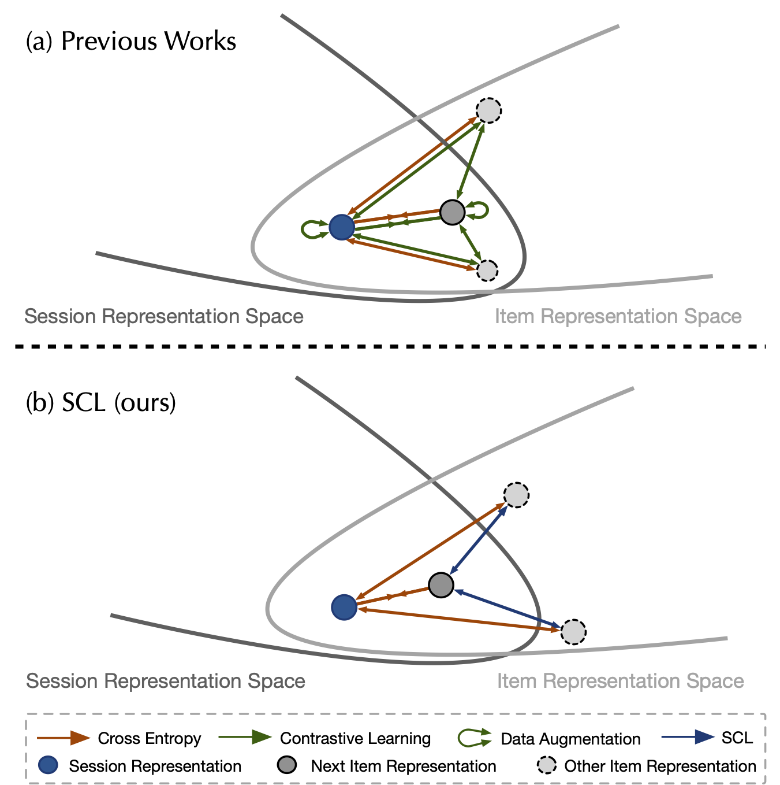

# Self Contrastive Learning for Session-based Recommendation
This repository provides the code for the paper titled **[Self Contrastive Learning for Session-based Recommendation]()**, making the integration of our code contributions into other projects more accessible.

  
  
  

  </a>
   

## Quick Links
- [Self Contrastive Learning for Session-based Recommendation](#self-contrastive-learning-for-session-based-recommendation)
  - [Quick Links](#quick-links)
  - [Overview](#overview)
  - [1. Requirements and Installation](#1-requirements-and-installation)
  - [2. Prepare the datasets](#2-prepare-the-datasets)
  - [3. Run our code](#3-run-our-code)
  - [Bugs or questions?](#bugs-or-questions)
  - [Acknowledgement](#acknowledgement)

## Overview
You can reproduce the experiments of our paper [Self Contrastive Learning for Session-based Recommendation](). We implement three baseline approaches including
- [Global Context Enhanced Graph Neural Networks for Session-based Recommendation](https://arxiv.org/abs/2106.05081), SIGIR 2020
- [Self-Supervised Graph Co-Training for Session-based
Recommendation](https://arxiv.org/pdf/2108.10560.pdf), CIKM 2021
- [Self-Supervised Hypergraph Convolutional Networks for
Session-based Recommendation](https://arxiv.org/pdf/2012.06852.pdf), AAAI 2021
with three datasets, including `TMALL`, `diginetica`, and `Nowplaying`.

<!-- > **Abstract**
>
>  -->

## 1. Requirements and Installation
Please refer to the repository of each baseline approach (`GCE-GNN`, `COTREC`, and `DHCN`) for the installation and requirements.

## 2. Prepare the datasets
We provide datasets in the `data` folder in each baseline folder, including `GCE-GNN`, `COTREC`, and `DHCN`.

## 3. Run our code
Please refer the `README.md` in each baseline folder (`GCE-GNN`, `COTREC`, and `DHCN`) for the instructions to run the code.

## Bugs or questions?
If you have any questions regarding the code or the paper, please feel free to reach out to the authors. If you experience any difficulties while using the code or need to report a bug, feel free to open an issue. We kindly ask that you provide detailed information about the problem to help us provide effective support.

## Acknowledgement
This repository is built upon the following repositories:
- [GCE-GNN](https://github.com/CCIIPLab/GCE-GNN)
- [COTREC](https://github.com/xiaxin1998/COTREC)
- [DHCN](https://github.com/xiaxin1998/DHCN)